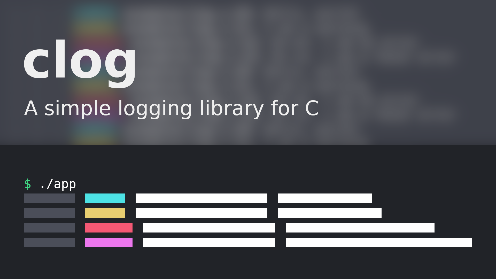
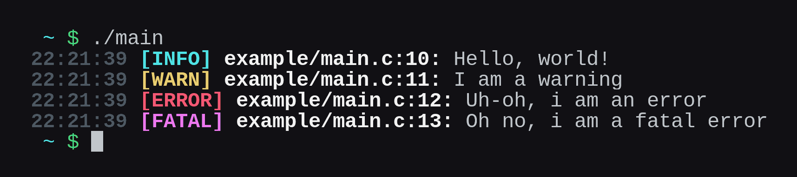

<h1 align="center">clog</h1>
<p align="center">
	<a href="./LICENSE">
		
	</a>
	<a href="https://github.com/LordOfTrident/clog/issues">
		
	</a>
	<a href="https://github.com/LordOfTrident/clog/pulls">
		
	</a>
	
	<br><br><br>
</p>

A simple single-header [STB-style](https://github.com/nothings/stb) C library for logging, inspired by [log.c](https://github.com/rxi/log.c).

## Table of contents
* [Simple example](#simple-example)
* [Quickstart](#quickstart)
* [Bugs](#bugs)

## Simple example
```c
#define CLOG_IMPLEMENTATION
#include "clog.h"

int main(void) {
	LOG_INFO("Hello, world!");
	LOG_WARN("I am a warning");
	LOG_ERROR("Something bad just happened!");
	LOG_FATAL("Something very bad happened, exiting...");

	return 0;
}
```
Output



## Quickstart
Just copy [`clog.h`](./clog.h) into your project and include it, or submodule this repository and
include the header. [See the example](./examples/log.c) to see how to use the library.

To compile and run the example, run
```sh
$ cc ./examples/log.c -o log
$ ./log
```

## Bugs
If you find any bugs, please create an issue and report them.
